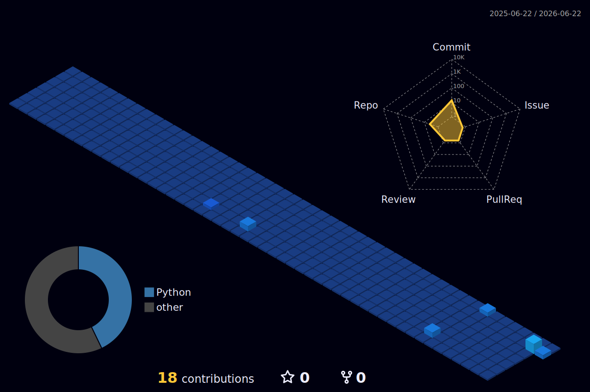

<h1 align="center">Hi there, I'm Roberto 👋</h1>
<h3 align="center">Data & AI Engineer | Building scalable pipelines and intelligent automations</h3>

  

I'm focused on transforming complex data into robust, automated architectures. I specialize in Data Engineering, MLOps, and workflow automation.

* 🚀 Currently architecting data pipelines and AI-driven automation systems.
* 🧠 Exploring advanced implementations with **dbt**, **Apache Airflow**, and **Parquet**.
* ⚡ Constantly automating workflows with **n8n** and **Python**.

---

### 💻 Tech Stack

  
  
  
  
  
  
  

---

### 📊 GitHub Stats

  
  

### 🏆 GitHub Trophies

  

### 🏙️ 3D Contribution City & 🐍 Snake

  

  

---

### 🚀 Recent Technical Achievements
---

### 📈 Weekly Development Activity

<!-- START_ACHIEVEMENTS -->

### job_hunter_ai
- Error synthesizing job_hunter_ai: HTTPConnectionPool(host='localhost', port=11434): Max retries exceeded with url: /api/generate (Caused by NewConnectionError("HTTPConnection(host='localhost', port=11434): Failed to establish a new connection: [Errno 111] Connection refused"))

<!-- END_ACHIEVEMENTS -->